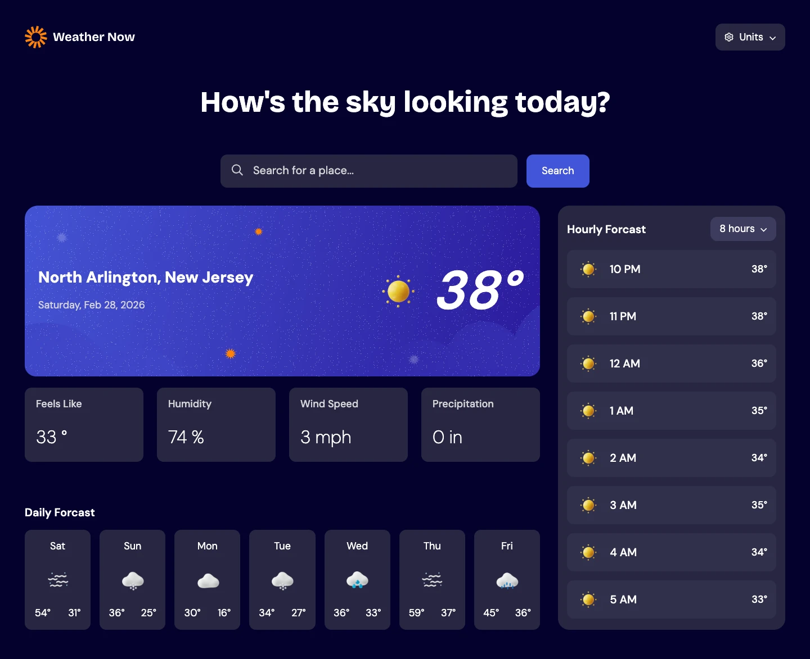

# Weather Now

A responsive forecast app that delivers real time weather information for anywhere in the world with current, daily, and hourly breakdowns, as well as unit toggling.



[Live Demo](https://matt-miguel.github.io/weather-app/) · [View Code](https://github.com/matt-miguel/weather-app)

---

## Overview

Weather Now delivers real-time forecasts anywhere in the world. Search any location and instantly see the current weather, 7-day forecast, and hourly breakdown in metric or imperial units — with your local weather loaded automatically as soon as you open the app.

---

## Features

- Loads initial data based on the users location
- Custom and accessible search with autocomplete dropdown
- 7 day forecast showing the high and low for each day
- Hourly forecast toggles between 8 and 12 hours
- Mobile first responsive layout

---

## Technical Highlights

**Debounced Search with Accessible Custom Dropdown**

Built a custom search component from scratch. Ensured accessibility by using semantic elements and the ARIA role of `listbox`. To ensure keyboard accessibility, `tabIndex=0` was added to list item. Made sure to debounce the input handler and add a minimum query length to avoid unnecessary API calls as the user types.

**Data Transformation with JavaScript Getters**

The Open-Meteo API provides raw, unprocessed data. In order to provide clean, ready to use data to the app, the data was processed at the time the API call is made. This was done in two steps. First was ensuring decimals were rounded to whole numbers. Second, JavaScript getters were used to filter the data to a 24 hour time period starting at the current time, which was all the app needs for its current functionality.

**Coordinated State with useEffect**

Used location and units as useEffect dependencies so the app re-fetches automatically when either changes — eliminating duplicated fetch logic and preventing stale data without over-triggering renders.

---

## Tech Stack

- React 19 + Vite
- CSS (Grid, custom properties, mobile-first)
- Geolocation API - used to get the users current location on page load and search location
- [Open-Meteo API](https://open-meteo.com/) — used to fetch the weather data (no key required)
- [Big Cloud Data](https://www.bigdatacloud.com/) - used to get the names of locations based on longitude and latitude

---

## Getting Started

```bash
git clone https://github.com/matt-miguel/weather-app
cd weather-app
npm install
npm run dev
```

> No API key required

> Geolocation permission required for automatic location detection

> CSS Anchor Positioning - requires Chrome 125+, Safari 26+, Firefox 147+

> Customizable Select - requires Chrome 135+ (will appear as default select on other browsers)

---

## Challenges & What I Learned

**Building an Accessible Search bar**

This was my first time building an accessible search bar and dropdown. I knew it needed to be accessible, so I had to research to make sure it could be navigated by keyboard. I learned about new ARIA roles and how to handle tab index properly, which is an invaluable lesson. This also gave me the opportunity to utilize the new CSS anchor positioning for styling.

**Handling Data and Multiple API calls**

This project taught me a lot about how to handle and process data BEFORE it gets to the app. I learned to make use of getter functions to filter data down to just what the app needs. Additionally, making use of async/await was critical to ensure data loaded correctly. Also, getting the useEffect setup properly so that the effect runs when the user changes units or searches required a deep understanding of my components.

---

## What I'd Improve

**Error and Loading States**

Currently error and loading states are implemented but can be improved. The loading state in particular could be styled better to more closely match the app layout. There should also be a loading state in the dropdown menu while the API is searching. An error state when the api call doesn't work should also be fleshed out more.

**CSS Fallbacks**

Fallbacks should be added for anchor positioning to make sure the dropdown is displayed correctly across different browsers. The customizable select should be further styled in a way to consider unsupported browsers, although it is a nice progressive enhancement.
